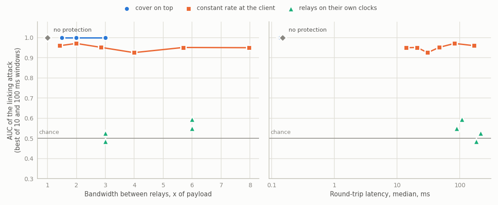
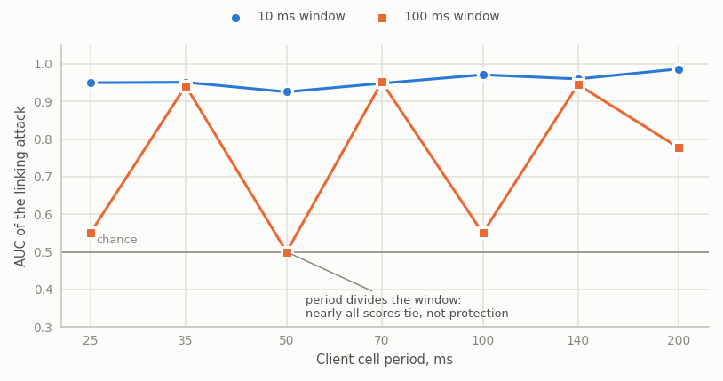

<p align="center">
  
</p>

<h1 align="center">jimichi</h1>

<p align="center">
  Confidential messaging that hides who talks to whom, and the measurements that prove it.
  <br>
  English | <a href="README.ru.md">Русский</a>
</p>

A confidential messaging system that protects metadata, and the measurements that show what
that protection is worth.

Messages travel through a chain of three relay nodes under nested encryption: every hop strips
exactly one layer and learns only its neighbours. Session keys are ephemeral, live in mlocked
memory outside the Go heap, are zeroed after use, and never reach disk or swap. Every cell is
the same size, so the length of a message says nothing about it.

Protecting content is the easy part. What this work measures is the harder question: how much
an observer who sees only timings and volumes can still learn, and what it costs to take that
away. The repository therefore contains both the system and the attack against it.

## What is measured

- **Key material.** Memory dumps of a live relay are searched for known key bytes, with and
  without memory locking and dump prevention; the same search runs against the container image
  and volumes.
- **Forward secrecy.** Recorded traffic is attacked with the node's long-term key in hand.
- **Metadata.** A traffic correlation attack links senders to receivers from timings and volumes
  alone; its ROC and AUC are reported against cover traffic rate, cell size policy and delays.
- **Partial compromise.** One and two nodes of three are compromised, including a node holding a
  valid certificate from a compromised CA; residual leakage is measured.
- **Cost.** Latency per hop, throughput, CPU, padding overhead, GOST versus X25519.

Threat modelling follows the FSTEC methodology of 2021-02-05; scenarios are named in plain words.

## Results

Preliminary series: ten flows, three relays, c25519 suite, five 30 s runs per configuration, each
client starting its schedule at a random phase. Every number is the median across the five runs.
Rows with the client alone come from the series over client rates, rows with relay clocks from
the series over relay periods, whose own client-only runs agree (AUC 0.947 at 70 ms, 0.950 at
35 ms). With five runs per point no difference is claimed as significant; the full series of
thirty runs per point is still to come.

A passive observer sees only when frames cross the entry link and the last link between relays. It
counts frames per time window for every flow and correlates every entry flow with every exit flow.
The window is the observer's choice, so both 10 ms and 100 ms are scored and the figure takes the
better one for the observer. Chance is AUC 0.5 and top-1 10%.

<picture>
  <source media="(prefers-color-scheme: dark)" srcset="docs/img/tradeoff-en-dark.png">
  
</picture>

| Protection | Bandwidth between relays | Median round trip | AUC, 10 ms | AUC, 100 ms | Top-1, 10 ms |
|---|---|---|---|---|---|
| none | x1.00 | 0.15 ms | 1.000 | 1.000 | 100% |
| cover on top, +2x | x2.99 | 0.13 ms | 1.000 | 1.000 | 100% |
| constant rate at the client, 70 ms | x2.85 | 47 ms | 0.948 | 0.952 | 60% |
| constant rate at the client, 35 ms | x5.69 | 21 ms | 0.951 | 0.942 | 70% |
| relays on their own clocks, 66.5 ms | x3.00 | 182 ms | 0.485 | 0.483 | 0% |
| relays on their own clocks, 33.25 ms | x5.99 | 89 ms | 0.528 | 0.550 | 10% |
| both, client 70 ms, relays 66.5 ms | x2.99 | 216 ms | 0.506 | 0.526 | 15% |
| both, client 35 ms, relays 33.25 ms | x5.99 | 108 ms | 0.596 | 0.486 | 10% |

- Cover traffic added on top of real messages does not help at all: even at three times the
  bandwidth every flow is linked.
- A constant rate at the client does not hide a flow either. Each client ticks with its own phase,
  the phase crosses a chain of relays that forward at once, and with a 10 ms window the attack links
  flows at every rate. A 100 ms window looks safe only where the period divides it: almost every
  window then holds the same number of cells and nearly all scores tie (AUC 0.50-0.55), which says
  nothing about protection. In this series the last client to start ticked in step with the
  observer's windows, a harness effect since removed.

<picture>
  <source media="(prefers-color-scheme: dark)" srcset="docs/img/window-en-dark.png">
  
</picture>

- Relays sending on their own clocks bring the attack down to chance. The price is a constant
  stream on every link a relay sends on and about 2.5 to 2.7 node periods added to a round trip
  (182 ms at 66.5 ms, 89 ms at 33.25 ms). The relay period is 5% shorter than the client's, so a
  missed tick is caught up.
- The client's constant rate still matters with relay clocks on: it hides the conversation from
  the entry node itself, which the observer here does not model.

Series are run on an idle host; every report row records the host load, the seeds and the code
revision.

## Cryptography

All primitives sit behind a single `CryptoProvider` interface. The primary suite is GOST
(VKO GOST R 34.10-2012, Kuznyechik-MGM, Streebog); a second suite (X25519, XChaCha20-Poly1305,
Ed25519) implements the same contract, so results are comparable with international work and a
difference points at the suite, not at the harness. Both must pass the same conformance tests.
See [docs/en/CRYPTO.md](docs/en/CRYPTO.md).

## Layout

```
cmd/          entry points: relay, client, jimichi
crypto/       CryptoProvider interface
  gost/       GOST suite
  c25519/     X25519 / XChaCha20-Poly1305 / Ed25519 suite
  secmem/     mlocked, non-dumpable, self-zeroing key buffers
  providertest/ conformance suite both suites must pass
wire/         fixed-size cells, nested layers, replay window
relay/        relay node
client/       sender, receiver, cover traffic
vault/        client container with two volumes
lab/          scenario/, metrics/, report/
web/          testbed dashboard
deploy/       compose/ for development, kind/ and base/ for the demo
docs/         documentation, en/ and ru/
```

## Documentation

- [docs/en/ARCHITECTURE.md](docs/en/ARCHITECTURE.md) - components, message flow, cell format.
- [docs/en/THREAT_MODEL.md](docs/en/THREAT_MODEL.md) - assets, adversaries, threats, deniability.
- [docs/en/CRYPTO.md](docs/en/CRYPTO.md) - the CryptoProvider contract.
- [docs/en/EXPERIMENT.md](docs/en/EXPERIMENT.md) - adversary models, metrics, experiment blocks.
- [docs/en/LIMITATIONS.md](docs/en/LIMITATIONS.md) - what the results do and do not cover.
- [docs/en/GLOSSARY.md](docs/en/GLOSSARY.md) - terms.

## Running the testbed

```
kind create cluster --config deploy/kind/cluster.yaml
make images
kind load docker-image jimichi/relay:dev jimichi/client:dev --name jimichi
kubectl apply -f deploy/base/relay.yaml
kubectl apply -f deploy/base/client.yaml
```

Three relays and a client appear in the `jimichi` namespace. A relay publishes its public key on
port 9100. Its aggregated counters go to stdout once a minute and to port 9101 on loopback only,
read through a port-forward:

```
kubectl -n jimichi port-forward deployment/relay-3 9101:9101
curl -s localhost:9101/stats
```

## Requirements

Go 1.27. Memory locking, dump prevention and the key-extraction scenarios are Linux-only; other
platforms build against stubs that report memory as unlocked, so a node refuses to start there.
Docker Compose for development, kind for the cluster demo.

## License

AGPL-3.0-or-later. See [LICENSE](LICENSE).
