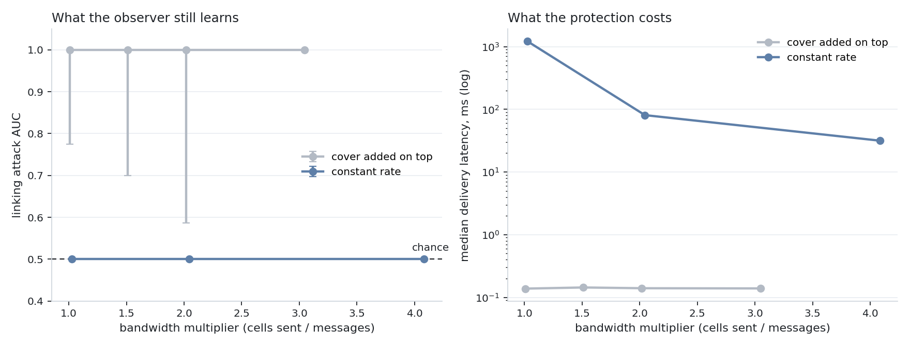

<p align="center">
  
</p>

<h1 align="center">jimichi</h1>

<p align="center">
  Confidential messaging that hides who talks to whom, and the measurements that prove it.
  <br>
  English | <a href="README.ru.md">Русский</a>
</p>

A confidential messaging system that protects metadata, and the measurements that show what
that protection is worth.

Messages travel through a chain of three relay nodes under nested encryption: every hop strips
exactly one layer and learns only its neighbours. Session keys are ephemeral, live in mlocked
memory outside the Go heap, are zeroed after use, and never reach disk or swap. Every cell is
the same size, so the length of a message says nothing about it.

Protecting content is the easy part. What this work measures is the harder question: how much
an observer who sees only timings and volumes can still learn, and what it costs to take that
away. The repository therefore contains both the system and the attack against it.

## What is measured

- **Key material.** Memory dumps of a live relay are searched for known key bytes, with and
  without memory locking and dump prevention; the same search runs against the container image
  and volumes.
- **Forward secrecy.** Recorded traffic is attacked with the node's long-term key in hand.
- **Metadata.** A traffic correlation attack links senders to receivers from timings and volumes
  alone; its ROC and AUC are reported against cover traffic rate, cell size policy and delays.
- **Partial compromise.** One and two nodes of three are compromised, including a node holding a
  valid certificate from a compromised CA; residual leakage is measured.
- **Cost.** Latency per hop, throughput, CPU, padding overhead, GOST versus X25519.

Threat modelling follows the FSTEC methodology of 2021-02-05; scenarios are named in plain words.

## Results

The first question is whether cover traffic hides who talks to whom. A passive observer sees only
when cells cross the entry link and the last link before the exit, and scores every pair of flows
by correlating cell counts in 100 ms windows.

<p align="center"></p>

| Traffic | Bandwidth | Attack AUC | Top-1 linking | Median latency |
|---|---|---|---|---|
| no cover | x1.01 | 1.000 | 100% | 0.14 ms |
| cover added on top, x1.5 | x1.51 | 1.000 | 100% | 0.14 ms |
| cover added on top, x2 | x2.02 | 1.000 | 100% | 0.14 ms |
| cover added on top, x3 | x3.05 | 1.000 | 100% | 0.14 ms |
| constant rate, 5 cells/s | x1.03 | 0.500 | 10% | 1215 ms |
| constant rate, 10 cells/s | x2.05 | 0.500 | 10% | 81 ms |
| constant rate, 20 cells/s | x4.08 | 0.500 | 10% | 32 ms |

Ten flows, three relays, 30 s per run, three runs per row, medians shown.

- Cover traffic added on top of real messages does not help at all: even at three times the
  bandwidth the observer links every flow, because bursts of real conversation still stand out.
- A constant sending rate, where a message takes the slot of a cover cell instead of being added to
  it, drops the attack to chance: 10% top-1 with ten flows is guessing.
- The price is latency, and it is bought back with bandwidth: 20 cells per second keep the median
  delivery at 32 ms.

Runs are sensitive to host load: individual runs taken while the machine was busy scored lower,
which widens the intervals of the unprotected rows. Series are therefore run on an idle host and
reported as medians.

## Cryptography

All primitives sit behind a single `CryptoProvider` interface. The primary suite is GOST
(VKO GOST R 34.10-2012, Kuznyechik-MGM, Streebog); a second suite (X25519, XChaCha20-Poly1305,
Ed25519) implements the same contract, so results are comparable with international work and a
difference points at the suite, not at the harness. Both must pass the same conformance tests.
See [docs/en/CRYPTO.md](docs/en/CRYPTO.md).

## Layout

```
cmd/          entry points: relay, client, jimichi
crypto/       CryptoProvider interface
  gost/       GOST suite
  c25519/     X25519 / XChaCha20-Poly1305 / Ed25519 suite
  secmem/     mlocked, non-dumpable, self-zeroing key buffers
  providertest/ conformance suite both suites must pass
wire/         fixed-size cells, nested layers, replay window
relay/        relay node
client/       sender, receiver, cover traffic
vault/        client container with two volumes
lab/          scenario/, metrics/, report/
web/          testbed dashboard
deploy/       compose/ for development, kind/ and base/ for the demo
docs/         documentation, en/ and ru/
```

## Documentation

- [docs/en/ARCHITECTURE.md](docs/en/ARCHITECTURE.md) - components, message flow, cell format.
- [docs/en/THREAT_MODEL.md](docs/en/THREAT_MODEL.md) - assets, adversaries, threats, deniability.
- [docs/en/CRYPTO.md](docs/en/CRYPTO.md) - the CryptoProvider contract.
- [docs/en/EXPERIMENT.md](docs/en/EXPERIMENT.md) - adversary models, metrics, experiment blocks.
- [docs/en/LIMITATIONS.md](docs/en/LIMITATIONS.md) - what the results do and do not cover.
- [docs/en/GLOSSARY.md](docs/en/GLOSSARY.md) - terms.

## Running the testbed

```
kind create cluster --config deploy/kind/cluster.yaml
make images
kind load docker-image jimichi/relay:dev jimichi/client:dev --name jimichi
kubectl apply -f deploy/base/relay.yaml
kubectl apply -f deploy/base/client.yaml
```

Three relays and a client appear in the `jimichi` namespace. A relay publishes its public key and
its aggregated counters on port 9100:

```
kubectl -n jimichi port-forward svc/relay-3 9100:9100
curl -s localhost:9100/stats
```

## Requirements

Go 1.23. Memory locking, dump prevention and the key-extraction scenarios are Linux-only; other
platforms build against stubs that report memory as unlocked, so a node refuses to start there.
Docker Compose for development, kind for the cluster demo.

## License

AGPL-3.0-or-later. See [LICENSE](LICENSE).
