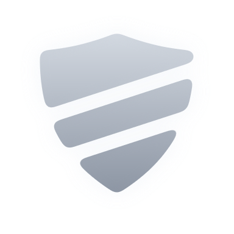
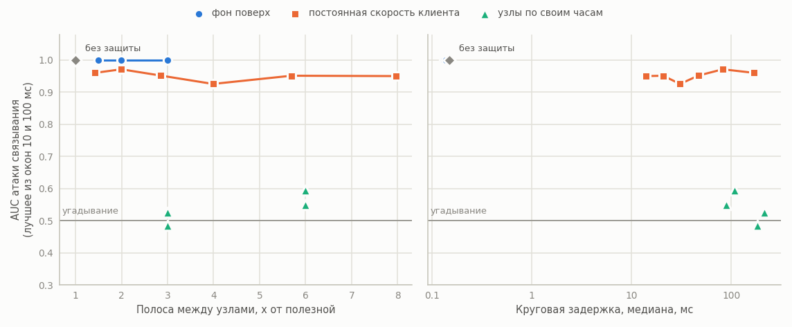
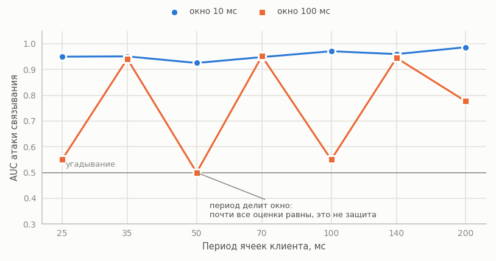

<p align="center">
  
</p>

<h1 align="center">jimichi</h1>

<p align="center">
  Конфиденциальный обмен сообщениями, скрывающий, кто с кем говорит, и измерения, которые это доказывают.
  <br>
  <a href="README.md">English</a> | Русский
</p>

Система конфиденциального обмена сообщениями с защитой метаданных и измерения, показывающие,
чего эта защита стоит.

Сообщение идёт через цепочку из трёх узлов с вложенным шифрованием: каждый узел снимает ровно
один слой и знает только соседей. Сессионные ключи эфемерные, буферы с ними лежат в
заблокированной памяти вне кучи Go и зануляются после использования, на диск ничего не попадает.
Копии, которые криптобиблиотеки держат на куче, этим не покрыты, см.
[границы применимости](docs/ru/LIMITATIONS.md). Все ячейки одного размера, поэтому длина
сообщения о нём ничего не говорит.

Защитить содержимое просто. Работа отвечает на более трудный вопрос: сколько всё ещё узнаёт
наблюдатель, который видит только тайминги и объёмы, и чем приходится платить, чтобы это отнять.
Поэтому в репозитории лежит и сама система, и атака против неё.

## Что измеряется

- **Ключевой материал.** В дампе памяти работающего узла ищутся байты известного ключа, со
  включённой блокировкой памяти и запретом дампов и без них; тот же поиск идёт по образу
  контейнера и томам.
- **Прямая секретность.** Записанный трафик атакуется, когда долговременный ключ узла уже в руках.
- **Метаданные.** Атака корреляции связывает отправителя и получателя только по таймингам и
  объёмам; её ROC и AUC приводятся в зависимости от интенсивности фонового трафика, размера
  ячейки и задержек.
- **Частичная компрометация.** Компрометируются один и два узла из трёх, включая узел с валидным
  сертификатом от скомпрометированного удостоверяющего центра; измеряется остаточная утечка.
- **Цена.** Задержка на хоп, пропускная способность, процессор, накладные расходы заполнения,
  ГОСТ против X25519.

Модель угроз строится по методике ФСТЭК России от 05.02.2021, сценарии называются словами.

## Результаты

Предварительная серия: десять потоков, три узла, набор c25519, пять прогонов по 30 с на
конфигурацию, расписание каждого клиента стартует со случайной фазой. Каждое число это медиана
пяти прогонов. Строки только с клиентом взяты из серии по скоростям клиента, строки с часами
узлов из серии по периодам узлов; её собственные прогоны только с клиентом совпадают (AUC 0.947 при
70 мс, 0.950 при 35 мс). При пяти прогонах на точку различия значимыми не заявляются; полная
серия по тридцать прогонов на точку впереди.

Пассивный наблюдатель видит только моменты, когда кадры пересекают входной канал и последний канал
между узлами. Он считает кадры в окнах времени для каждого потока и коррелирует каждый входной
поток с каждым выходным. Окно выбирает наблюдатель, поэтому считаются оба, 10 и 100 мс, а на
графике взято лучшее для него. Угадывание это AUC 0.5 и точность top-1 10%.

<picture>
  <source media="(prefers-color-scheme: dark)" srcset="docs/img/tradeoff-ru-dark.png">
  
</picture>

| Защита | Полоса между узлами | Медиана круга | AUC, 10 мс | AUC, 100 мс | Top-1, 10 мс |
|---|---|---|---|---|---|
| нет | x1.00 | 0.15 мс | 1.000 | 1.000 | 100% |
| фон поверх, +2x | x2.99 | 0.13 мс | 1.000 | 1.000 | 100% |
| постоянная скорость клиента, 70 мс | x2.85 | 47 мс | 0.948 | 0.952 | 60% |
| постоянная скорость клиента, 35 мс | x5.69 | 21 мс | 0.951 | 0.942 | 70% |
| узлы по своим часам, 66.5 мс | x3.00 | 182 мс | 0.485 | 0.483 | 0% |
| узлы по своим часам, 33.25 мс | x5.99 | 89 мс | 0.528 | 0.550 | 10% |
| оба, клиент 70 мс, узлы 66.5 мс | x2.99 | 216 мс | 0.506 | 0.526 | 15% |
| оба, клиент 35 мс, узлы 33.25 мс | x5.99 | 108 мс | 0.596 | 0.486 | 10% |

- Фоновый трафик поверх сообщений не помогает вообще: даже при тройной полосе связывается каждый
  поток.
- Постоянная скорость на клиенте тоже не скрывает поток. Каждый клиент тикает со своей фазой, фаза
  проходит через цепочку узлов, пересылающих сразу, и при окне 10 мс атака связывает потоки на
  любой скорости. Окно 100 мс выглядит безопасным только там, где период его делит: тогда почти в
  каждом окне одинаковое число ячеек и почти все оценки равны (AUC 0.50-0.55), о защите это ничего
  не говорит. В этой серии последний запущенный клиент тикал в такт окнам наблюдателя, этот
  эффект стенда с тех пор убран.

<picture>
  <source media="(prefers-color-scheme: dark)" srcset="docs/img/window-ru-dark.png">
  
</picture>

- Отправка узлами по своим часам опускает атаку до угадывания. Цена: постоянный поток на каждом
  канале, по которому шлёт узел, и около 2.5-2.7 периода узла к кругу (182 мс при 66.5 мс, 89 мс
  при 33.25 мс). Период узла на 5% короче клиентского, чтобы пропущенный тик наверстать.
- Постоянная скорость клиента нужна и при часах на узлах: она скрывает разговор от самого входного
  узла, которого здешний наблюдатель не моделирует.

Серии гоняются на свободном хосте; в каждой строке отчёта записаны загрузка хоста, зёрна и ревизия
кода.

## Криптография

Все примитивы находятся за единым интерфейсом `CryptoProvider`. Набор по умолчанию X25519,
XChaCha20-Poly1305 и Ed25519, поэтому результаты сравнимы с зарубежными работами. Второй набор
реализует российские стандарты (VKO ГОСТ Р 34.10-2012, Кузнечик в режиме MGM, Стрибог) за тем же
контрактом и включается флагом `-suite gost`; различие между ними указывает на набор, а не на
стенд. Оба проходят один и тот же набор тестов соответствия и контрольные примеры из стандартов.
См. [docs/ru/CRYPTO.md](docs/ru/CRYPTO.md).

## Раскладка

```
cmd/          точки входа: relay, client, lab
crypto/       интерфейс CryptoProvider
  gost/       набор ГОСТ
  c25519/     набор X25519 / XChaCha20-Poly1305 / Ed25519
  suite/      выбор набора по имени
  secmem/     буферы ключей под mlock, без дампов, с занулением
  providertest/ тесты соответствия для обоих наборов
wire/         ячейки постоянного размера, вложенные слои, окно повторов
link/         канальное шифрование между соседями, кадры одного размера
relay/        узел-ретранслятор
client/       отправка, приём, фоновый трафик
vault/        контейнер клиента с двумя томами
lab/          scenario/, metrics/, report/
web/          дашборд стенда
deploy/       compose/ для разработки, kind/ и base/ для демонстрации
docs/         документация, en/ и ru/
```

## Документация

- [docs/ru/ARCHITECTURE.md](docs/ru/ARCHITECTURE.md) - компоненты, поток сообщения, формат ячейки.
- [docs/ru/THREAT_MODEL.md](docs/ru/THREAT_MODEL.md) - активы, нарушители, угрозы, отрицаемость.
- [docs/ru/CRYPTO.md](docs/ru/CRYPTO.md) - контракт CryptoProvider.
- [docs/ru/EXPERIMENT.md](docs/ru/EXPERIMENT.md) - модели нарушителя, метрики, блоки экспериментов.
- [docs/ru/LIMITATIONS.md](docs/ru/LIMITATIONS.md) - границы применимости результатов.
- [docs/ru/GLOSSARY.md](docs/ru/GLOSSARY.md) - термины.

## Запуск стенда

```
kind create cluster --config deploy/kind/cluster.yaml
make images
kind load docker-image jimichi/relay:dev jimichi/client:dev --name jimichi
kubectl apply -f deploy/base/relay.yaml
kubectl apply -f deploy/base/client.yaml
```

В пространстве имён `jimichi` поднимаются три узла и клиент. Узел публикует свой открытый ключ на
порту 9100. Агрегированные счётчики раз в минуту идут в stdout и на порт 9101 только на loopback,
читаются через port-forward:

```
kubectl -n jimichi port-forward deployment/relay-3 9101:9101
curl -s localhost:9101/stats
```

## Требования

Go 1.27. Блокировка памяти, запрет дампов и сценарии извлечения ключей работают только на Linux;
на других платформах собираются заглушки, которые сообщают, что память не заблокирована, и узел
отказывается стартовать. Docker Compose для разработки, kind для демонстрации в кластере.

## Лицензия

AGPL-3.0-or-later. См. [LICENSE](LICENSE).
